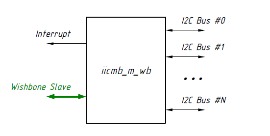
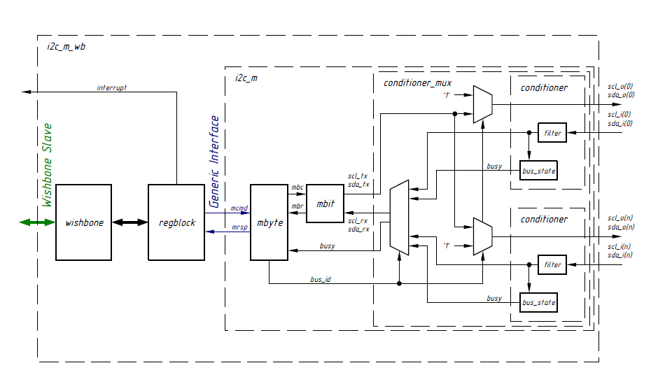
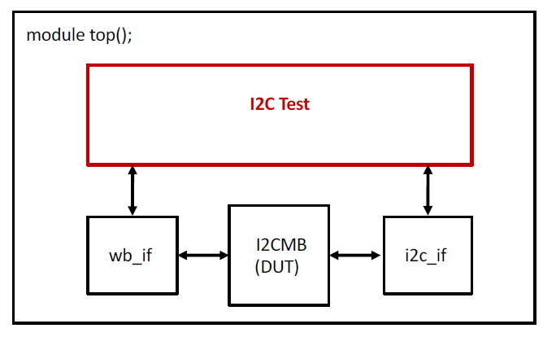
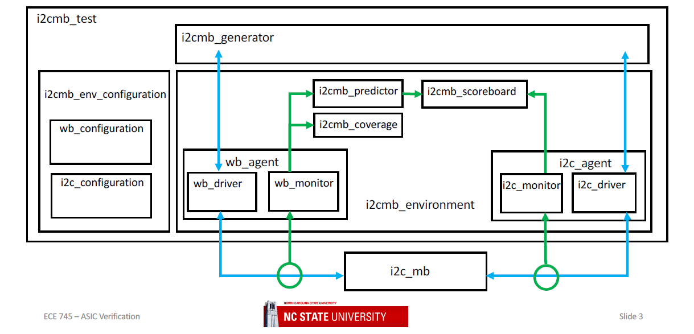

# Functional Verification of I²C Multi-Bus Master (Wishbone–I²C Bridge)
This project presents the functional verification of an I²C Multi-Bus Master, a Wishbone to I²C bridge IP capable of controlling multiple I²C buses through a memory-mapped Wishbone interface. Developed as part of ECE 745 : ASIC Verification at North Carolina State University, this work implements the full verification lifecycle using SystemVerilog and the NCSU UVM-style base class library, including interface verification, layered testbench construction, coverage planning, and closure.

---
## Repository Structure
```bash
I2CMB-Verification/
├── assets/                          # Images, figures, and waveform snapshots used in README
│
├── docs/                            # Design documents, protocol specs, and test plan
│   ├── i2cmb_mb.pdf                 # OpenCores I2C Multiple Bus Controller specification
│   ├── i2cmb_test_plan.xlsx         # Functional test plan with coverage matrix
│   ├── UM10204_I2C_Specification.pdf # NXP I2C-bus specification and user manual (official protocol reference)
│   └── AN1602_I2C_Basics.pdf        # Application note explaining I2C protocol fundamentals
│
├── project_benches/                 # Complete project setup for simulation
│   ├── rtl/                         # RTL source files (VHDL) for I2CMB DUT
│   ├── sim/                         # Simulation scripts, makefiles, and regression setup
│   └── testbench/                   # Top-level testbench connecting env, agents, and DUT
│
├── verification_ip/                 # Reusable Verification IP components
│   ├── environment_packages/        # Environment, predictor, scoreboard, config classes
│   │   └── i2cmb_env_pkg/
│   │
│   ├── interface_packages/          # Protocol-specific agents and interfaces
│   │   ├── common_pkg/              # Shared typedefs and utility classes
│   │   ├── i2c_pkg/                 # I²C slave interface agent
│   │   └── wb_pkg/                  # Wishbone master interface agent
│   │
│   └── ncsu_pkg/                    # Base classes and macros from NCSU verification framework
│       ├── src/
│       ├── Makefile
│       ├── ncsu_macros.svh
│       └── ncsu_pkg.sv
│
└── README.md                        # Detailed project documentation and usage guide
```

## Objective
To verify that the I2CMB Master correctly performs Wishbone-to-I²C transactions while ensuring protocol compliance, reliable multi-bus operation, and proper handling of arbitration and error conditions.

### Verification Goals
- Validate Wishbone protocol timing and register-level operations.
- Ensure I²C protocol compliance – Start/Stop sequences, ACK/NACK, data phase, and arbitration.
- Verify correct bus switching among up to 16 I²C buses.
- Check FSM transitions, command responses, and error signaling.
- Complete functional coverage closure with randomized and directed tests.

## DUT (Design Under Test)
The I2CMB Master (iicmb_m_wb.vhd) operates as a Wishbone slave, receiving configuration and command writes from a CPU or controller, and as a multi-bus I²C master, generating protocol-accurate I²C signals to communicate with multiple external devices. It asserts an interrupt signal to indicate transaction completion or to report an error condition.
<p align="center">  <br><em>Figure 1 – I2CMB master interfacing a Wishbone slave with multiple I²C buses and interrupt signaling.</em> </p>

### Internal Architecture
The DUT integrates several key sub-modules:
- wishbone.vhd – Adapts the Wishbone bus to internal register commands.
- regblock.vhd – Implements four memory-mapped control/status registers.
- iicmb_m.vhd – Central controller integrating:
    - Byte-level FSM (mbyte.vhd) – Handles high-level I²C operations (Start, Stop, Read, Write, Set Bus, Wait).
    - Bit-level FSM (mbit.vhd) – Generates SCL/SDA waveforms for each bit transfer.
    - conditioner_mux.vhd – Selects active I²C bus by ID.
    - filter.vhd – Digitally filters SCL/SDA signals for glitch rejection.
    - bus_state.vhd – Monitors activity on all connected buses.
<p align="center">  <br><em>Figure 2 – Detailed internal architecture showing FSM hierarchy and bus multiplexer.</em> </p>

## Register Map (Wishbone Interface)
The design exposes four 8-bit registers accessible via the Wishbone bus, each serving a specific control or monitoring purpose.

| Register | Offset | Access | Description |
|-----------|:-------:|:-------:|-------------|
| **CSR (Control/Status)** | 0x00 | R/W | Enables core, controls interrupts, shows bus ID/status |
| **DPR (Data/Parameter)** | 0x01 | R/W | Holds data bytes or parameters (bus ID, etc.) |
| **CMDR (Command)** | 0x02 | R/W | Issues byte-level commands (Start, Stop, Read, Write, Set Bus) |
| **FSMR (FSM State)** | 0x03 | R | Reports byte- and bit-level FSM states |

Key bits: **E** – Enable | **IE** – Interrupt Enable | **BB** – Bus Busy | **DON/NAK/AL/ERR** – Command status.

## Top-Level Testbench
The top module instantiates the DUT along with the Wishbone and I²C interfaces. These interfaces provide physical connectivity for the testbench and are passed into the verification environment created by the i2cmb_test class, which coordinates stimulus generation, checking, and coverage collection.
This setup allows the test class to drive transactions from the generator through the Wishbone agent and monitor responses through the I²C agent.
```systemverilog
module top;
  wb_if wb_if_inst();
  i2c_if i2c_if_inst();

  iicmb_m_wb dut (
    .wb_clk_i(wb_if_inst.clk),
    .wb_rst_i(wb_if_inst.rst),
    .scl(i2c_if_inst.scl),
    .sda(i2c_if_inst.sda)
  );
endmodule
```
<p align="center">  <br><em>Figure 3 – Top-level testbench showing DUT, Wishbone/I²C interfaces, and I2C test environment hierarchy.</em> </p>

## Layered Verification Environment
A UVM-style layered testbench built on NCSU base classes separates configuration, transaction generation, monitoring, and checking.
<p align="center">  <br><em>Figure 4 – Hierarchical environment with generator, predictor, scoreboard, and coverage blocks.</em> </p>

### Environment Components
- **i2cmb_generator** – Generates randomized and directed transactions that stimulate the DUT through the Wishbone interface.
- **Wishbone Agent** – Drives register-level bus transactions to access and control the DUT.
- **I²C Agent** – Implements a reactive I²C slave model that provides ACK/NACK and data responses.
- **i2cmb_predictor** – Models the expected I²C behavior for each Wishbone command and predicts DUT outputs.
- **i2cmb_scoreboard** – Compares DUT outputs against predicted values to ensure data integrity and protocol correctness.
- **i2cmb_coverage** – Collects functional coverage for command types, bus switching, and FSM transitions.
- **Assertions** – Check timing and protocol handshakes across both Wishbone and I²C interfaces.

Each agent extends ncsu_agent, following UVM methodology principles for driver, monitor, and configuration management.

## Test Plan Highlights
From i2cmb_test_plan.xlsx, key coverage items and directed tests:

| Category | Test / Covergroup | Purpose |
|-----------|------------------|----------|
| **Protocol Coverage** | `i2c_coverage_cg` – op, addr, read/write data | Validate I²C protocol transactions |
| **Register Tests** | `rw_wr_per_field`, `check_default_values`, `regfield_aliasing_test` | Check permissions, defaults, and isolation |
| **Assertions** | `assert_irq_check`, `check_start`, `ack_check` | Ensure correct IRQ, START, and ACK/NACK behavior |
| **Functional Tests** | `i2cmb_generator_test`, `check_base_test` | Verify Wishbone → I²C data flow |
| **Coverage Models** | `i2cmb_coverage_cg`, `scbd_coverage_cg` | Monitor done bit, core enable, and scoreboard matches |
| **FSM Checks** | `fsmr_check`, FSM Bit/Byte Coverage | Confirm complete FSM traversal |
| **Stress Regression** | Randomized tests + multiple seeds | Ensure robust bus switching and error recovery |

## Simulation Setup
To compile, run, and merge coverage results for the I2CMB verification environment using Mentor QuestaSim.
### Steps to Run
``` bash
cd project_benches/sim

# Compile and run the default test
make run_cli

# Run specific testcases
make run_cli GEN_TRANS_TYPE=i2cmb_generator
make run_cli GEN_TRANS_TYPE=rw_wr_per_field
make run_cli GEN_TRANS_TYPE=check_default_values
make run_cli GEN_TRANS_TYPE=fsmr_check
make run_cli GEN_TRANS_TYPE=regfield_aliasing_test
make run_cli GEN_TRANS_TYPE=check_base_test

# Merge and view coverage
make merge_coverage
make view_coverage
``` 
### Regression and Automation
``` bash
# Execute full regression (runs all tests + merges UCDB)
make regress
```
### Interactive Simulation and Debug Flow
``` bash
# Clean existing work libraries and logs
make clean

# Compile all RTL and testbench components
make compile

# Launch simulation interactively with waveform debugging
make simulate
```

## Verification Results
The verification environment achieved full coverage closure across all functional domains and regression scenarios:
- Full functional and code coverage closure achieved.
- Assertions and coverpoints mapped to UCDB for traceability.
- Automated regression using regress.sh merged coverage and generated reports.
- DUT verified for protocol, register, and FSM correctness per specification.

---
### References
- OpenCores I2C Multiple Bus Controller Specification
- **UM10204 – _I2C-bus Specification and User Manual_, Rev. 6, NXP Semiconductors (2014)** – the official standard defining I²C electrical and timing behavior, multi-master arbitration, start/stop conditions, acknowledge bits, and protocol extensions.
- **AN1602 – _I2C Basics_, Excelsys Technologies (2013)** – an application note explaining I²C signaling (SDA/SCL), byte transfer, arbitration, and acknowledgment rules with practical diagrams.
- ECE 745 – ASIC Verification, North Carolina State University

---
**Author:** Vishnuvardhan Chilukoti  
**Course:** ECE 745 – ASIC Verification, North Carolina State University  
**Email:** vchiluk3@gmail.com


