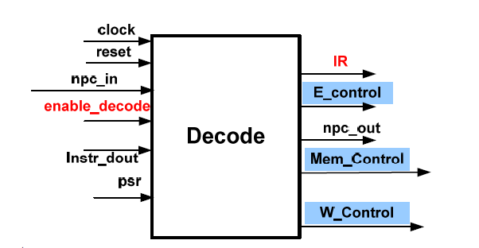
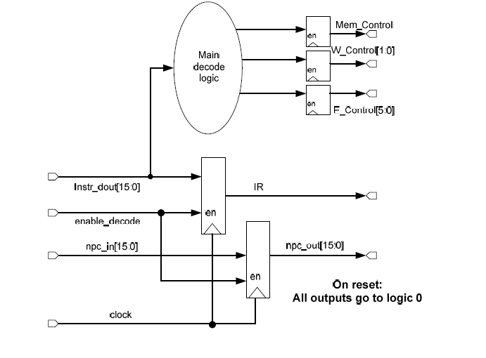
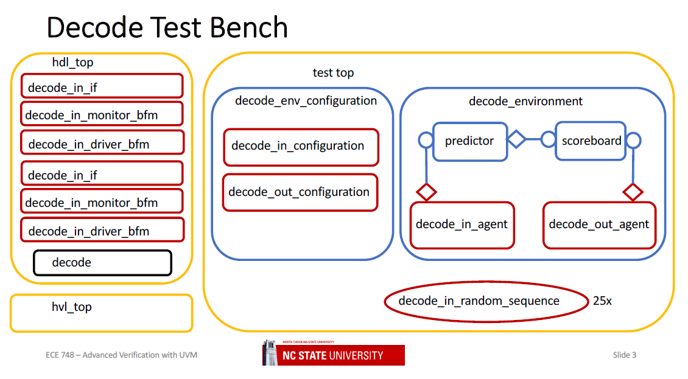

# Verification of LC-3 CPU decode stage
This repository documents the SystemVerilog/UVM verification of the LC-3 Decode Unit, a critical pipeline stage that translates instructions into control signals.
Developed as part of ECE 748:Advanced Verification with UVM at North Carolina State University, this project demonstrates a layered UVM-based verification approach for an academic RISC-style CPU.

## Repository Structure
``` bash 
decode_unit_uvm/
├── assets/                           # Project visuals for documentation
│
├── docs/                             # Reference documents
│   ├── LC3_DesignSpec.pdf
│   └── LC3_InstructionSet.pdf
│
├── rtl/                              # Design files (Decode Unit RTL)
│   ├── Decode_Pipelined.v
│   └── data_defs.v
│
├── sim/                              # Simulation scripts and setup
│   ├── Makefile                      # Build & run automation
│   ├── filelist.f                    # RTL + TB file list
│   └── wave.do                       # Predefined waveform setup
│
├── tb/                               # Testbench hierarchy
│   ├── testbench/
│   │   ├── hdl_top.sv                # DUT + interface instantiation
│   │   └── hvl_top.sv                # UVM environment instantiation
│   │
│   └── tests/
│       └── src/
│           └── test_top.svh          # Base + extended UVM tests
│
├── verification_ip/                  # VIP and reusable components
│   ├── interface_packages/           # Interfaces & signal-level connections
│   │   ├── decode_in_pkg/
│   │   └── decode_out_pkg/
│   │
│   └── environment_packages/         # UVM Environment & agent packages
│       ├── decode_env_pkg/
│       └── lc3_prediction_pkg/       # Reference model for expected decode outputs
│
└── README.md                         # Project documentation
```

## Project Overview
### Objective
Verify the LC-3 Decode Unit, which interprets the fetched instruction (IR) and generates control signals that steer the subsequent pipeline stages: Execute, Memory, and Writeback.

### Verification Goals
- Validate correct decoding of all LC-3 instruction classes.
- Ensure accurate generation of control signals (E_Control, Mem_Control, W_Control, enable_decode_out).
- Confirm pipeline data propagation for IR and npc_out.
- Detect and report mismatches between predicted and actual decode behavior

## LC-3 Decode Unit Architecture
<p align="center">
  
  <br><em>Figure 1 – LC-3 Decode Stage architecture (adapted from LC3_DesignSpec.pdf)</em>
</p>

The Decode Unit receives a 16-bit instruction and the next-PC (npc_in) from the Fetch stage and produces:
- IR → Propagated instruction register value
- E_Control → ALU/Execute control signals
- Mem_Control → Memory access control
- W_Control → Writeback source selection
- enable_decode_out → Decode enable flag

<p align="center">
  
  <br><em>Figure 2 – Internal Decode logic from LC3_DesignSpec.pdf showing opcode decoding and control generation.</em>
</p>

### Verification Flow
A modular UVM testbench was constructed to verify the Decode Unit in isolation.
It consists of two interface agents, a predictor, and a scoreboard, all connected through a UVM environment.

The environment also includes configuration classes:
- **decode_env_configuration** – initializes the environment and connects agents.
- **decode_in_configuration / decode_out_configuration** – manage individual agent configurations.

<p align="center">
  
  <br><em>Figure 3 – UVM environment architecture for Decode Unit verification.</em>
</p>

| Component | Description |
|------------|-------------|
| **decode_in_agent** | Generates and drives instruction input transactions (`instr_dout`, `npc_in`). |
| **decode_out_agent** | Monitors DUT outputs and sends them to the scoreboard. |
| **decode_predictor** | Computes expected decode outputs (reference model). |
| **decode_scoreboard** | Compares actual and predicted transactions. |
| **decode_env_pkg** | Integrates agents, predictor, and scoreboard. |
| **test_top.svh** | Defines top-level test configuration and sequence execution. |

### Methodology
- Sequence Generation 
    - Randomized and directed sequences drive various instruction opcodes and operands.
- Driver and Monitor
    - The driver sends transactions to the DUT via decode_in_if.
    - The monitor samples output signals from decode_out_if.
- Predictor and Scoreboard
    - The predictor (in lc3_prediction_pkg) models correct decode logic.
    - The scoreboard compares predicted vs actual transactions and reports status.

### Simulation Setup
- To compile and run the environment:
``` bash
cd decode_unit_uvm/sim
make debug
```
---
### References
- LC3_DesignSpec.pdf — Decode architecture and signal descriptions.
- LC3_InstructionSet.pdf — LC-3 instruction opcodes and formats.
- ECE 748 – Advanced Verification with UVM, NCSU.

---
**Author:** Vishnuvardhan Chilukoti  
**Course:** ECE 748 – Advanced Verification with UVM, North Carolina State University  
**Email:** vchiluk3@gmail.com


