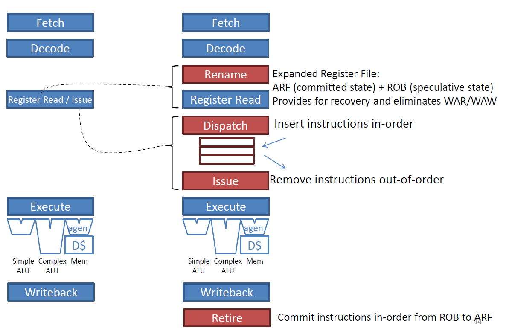
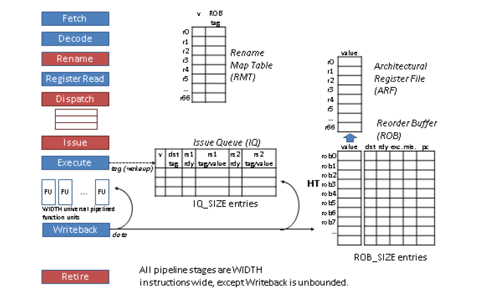

# Out-of-Order Superscalar Processor Simulator
This repository documents my implementation of a **cycle-accurate Out-of-Order (OOO) Superscalar Processor Simulator** written in **C++**, developed as part of **ECE 563 – Microprocessor Architecture (Prof. Eric Rotenberg, North Carolina State University)**.

The simulator models the **core microarchitecture** of a modern superscalar processor with **dynamic scheduling**, **register renaming**, and **in-order retirement**. It supports configurable **pipeline width (WIDTH)**, **Reorder Buffer size (ROB_SIZE)**, and **Issue Queue size (IQ_SIZE)** for exploring instruction-level parallelism (ILP).

## Overview
Modern high-performance CPUs execute multiple instructions per cycle using out-of-order techniques. This simulator captures those key concepts by implementing:
- **Dynamic scheduling** with *register renaming* and *data dependency tracking*  
- **Superscalar issue** — up to `WIDTH` instructions can enter the pipeline per cycle  
- **Reorder Buffer (ROB)** ensuring in-order commitment and precise exceptions  
- **Issue Queue (IQ)** handling out-of-order instruction dispatch when operands are ready  
- **Rename Map Table (RMT)** eliminating WAR/WAW hazards  
- **Perfect memory and branch assumptions:**  
  - Perfect **branch prediction** → no misprediction recovery  
  - Perfect **cache hierarchy** → no memory stalls  
Together, these enable analysis of instruction throughput under *idealized core conditions*.

This simulator’s dynamic scheduling approach is based on **Tomasulo’s algorithm**, originally developed for the IBM System/360 Model 91. 

It extends Tomasulo’s core concepts including register renaming, out of order issue, and tag based data forwarding, along with modern architectural features such as a **Reorder Buffer (ROB)** for in order retirement and a **Rename Map Table (RMT)** for precise state tracking. These structures reflect the principles used in today’s superscalar processors.

## Repository Structure
```bash
ooo-superscalar-sim/
├── src/                    # C++ sources implementing the OOO pipeline stages
├── traces/                 # Instruction traces used as simulator input
├── assets/                 # Architecture diagrams (for README)
├── Makefile                # Builds simulator → ./sim
└── README.md
```

## From In-Order to Out-of-Order
<p align="center"> <br> <em>Figure 1 – Evolution from an in-order pipeline to an out-of-order (OOO) superscalar design. Introducing rename, dispatch, and issue stages enables dynamic scheduling and register renaming.</em> </p>

Traditional in-order pipelines stall when operands are unavailable or dependencies exist. By adding Rename, Dispatch, and Issue stages, the processor decouples instruction scheduling from execution:
- Instructions are inserted in-order into the Issue Queue after renaming.
- They execute out-of-order when source operands become ready.
- Retirement occurs strictly in-order via the ROB, maintaining precise architectural state.

This transformation removes WAR/WAW hazards and increases ILP by allowing independent operations to proceed early.

# Architecture
<p align="center">
  <br>
  <em>Figure 2 – Out-of-Order Superscalar Pipeline showing all stages, Rename Map Table (RMT), Issue Queue (IQ), and Reorder Buffer (ROB).</em>
</p>
Each pipeline stage processes up to WIDTH instructions per cycle, except Writeback, which is unbounded. Key hardware structures modeled in the simulator:

| Component | Description |
|------------|-------------|
| **Rename Map Table (RMT)** | Tracks speculative mappings from logical to physical registers (ROB entries). Eliminates WAR/WAW hazards. |
| **Reorder Buffer (ROB)** | Maintains instruction state until retirement and commits results in-order to the Architectural Register File (ARF). |
| **Issue Queue (IQ)** | Holds ready and waiting instructions and performs wakeup and select each cycle. |
| **Architectural Register File (ARF)** | Stores committed register values and is updated only at retirement. |
| **Functional Units (FUs)** | Model execution latency of different operations (simple ALU, complex ALU, MEM). |

## Pipeline Stages
1. Fetch – Fetch up to `WIDTH` instructions from the trace per cycle.
2. Decode – Parse instruction fields (`op_type`, `dst`, `src1`, `src2`).
3. Rename – Map logical registers to ROB entries via the Rename Map Table.
4. Register Read – Check operand readiness and read or wait for producer tags.
5. Dispatch – Insert renamed instructions into the Issue Queue (in-order).
6. Issue – Select ready instructions (out-of-order) and send to execution units.
7. Execute – Simulate latency for each operation type.
8. Writeback – Broadcast results to dependent instructions (tag wakeup).
9. Retire – Commit completed instructions in program order from the ROB.

## Trace Format
Each input trace contains one instruction per line, representing the architectural state visible to the front end.
```bash
<PC> <op_type> <dest> <src1> <src2>
```
| Field          | Meaning                                   |                 |                    |
| -------------- | ----------------------------------------- | --------------- | ------------------ |
| `PC`           | Instruction program counter (hexadecimal) |                 |                    |
| `op_type`      | Operation type: 0 = simple ALU            | 1 = complex ALU | 2 = mult/div / mem |
| `dest`         | Destination logical register (–1 if none) |                 |                    |
| `src1`, `src2` | Source logical registers (–1 if unused)   |                 |                    |

Example:
```bash
0x00403000 0 3 1 2
0x00403004 1 6 3 5
0x00403008 2 8 6 -1
```

## Compilation
You can compile the simulator using the provided Makefile or manually.

### Using Makefile
```bash 
make
```
This compiles `src/sim_proc.cc` and produces an executable named `sim`.

To clean build files:
```bash
make clean
```

### Manual compilation
```bash
g++ -std=c++11 -O3 src/sim_proc.cc -o sim -lm
```

## Running the Simulator
Run the simulator with:
```bash 
./sim <WIDTH> <ROB_SIZE> <IQ_SIZE> <trace_file>
```
Example:
```bash
./sim 4 128 64 traces/gcc_trace.txt
```
| Argument     | Description                                     |
| ------------ | ----------------------------------------------- |
| `WIDTH`      | Superscalar width (instructions per cycle)      |
| `ROB_SIZE`   | Number of entries in the Reorder Buffer         |
| `IQ_SIZE`    | Number of entries in the Issue Queue            |
| `trace_file` | Input instruction trace (e.g., `gcc_trace.txt`) |

## Design Assumptions
- Perfect branch prediction → no recovery penalty.
- Perfect memory subsystem → no cache misses.
- Unlimited Writeback bandwidth.
- All functional units are pipelined and operate concurrently.
- Single clocked simulation loop: fetch → retire each cycle.
These assumptions isolate the core out-of-order behavior to study scheduling, dependency resolution, and ILP limits.

---
**Tools and Environment:**  
C++ (C++11), Linux / ETX Cluster, Makefile, Gradescope Autograder  
Traces: gcc, perl  
 

**Author:** Vishnuvardhan Chilukoti  


