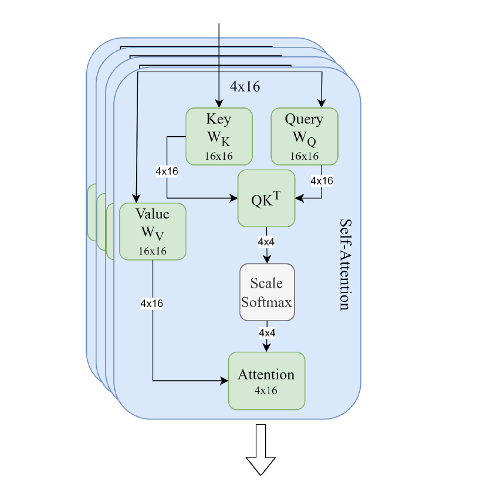
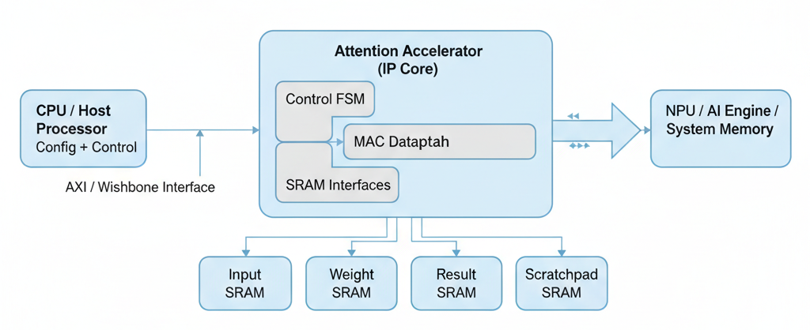
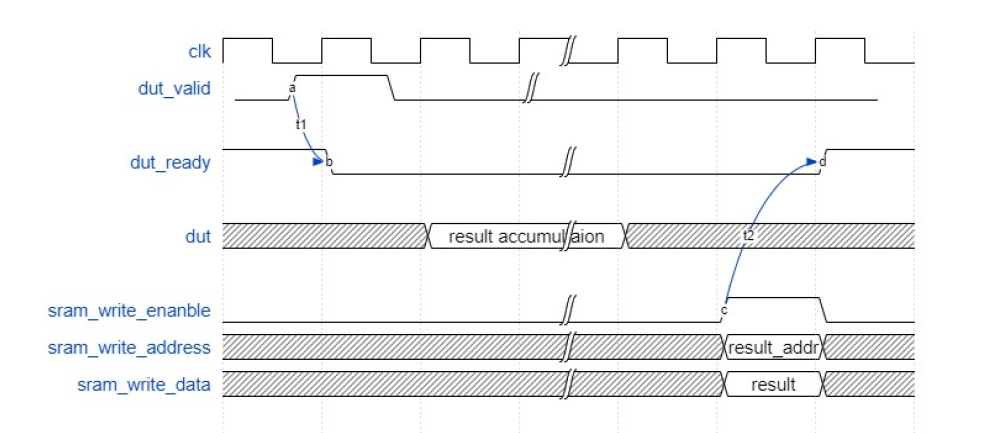
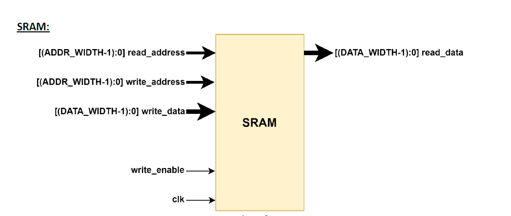
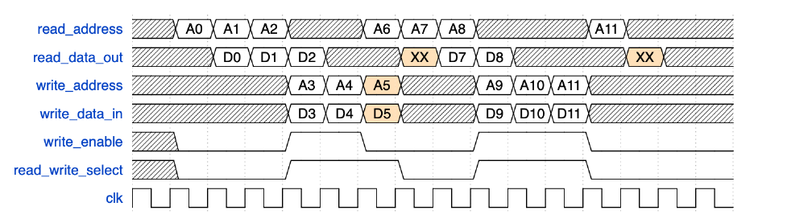

# Transformer Scaled Dot-Product Attention Accelerator (ASIC Design)
This project presents the **RTL design and synthesis of a Scaled Dot-Product Attention Accelerator**, the mathematical heart of the Transformer architecture used in modern NLP and AI systems. Developed as part of **ECE 564 – ASIC & FPGA Design using Verilog** at **North Carolina State University**, this design realizes the full attention pipeline in **Verilog/SystemVerilog** with a 15-state FSM, four SRAMs, and a pipelined multiply-accumulate datapath.

## Repository Structure
```bash
transformer-attention-accelerator/
├── docs/                 # DUT Spec.,Figures and example explanation
├── inputs/               # Positive testcases (.dat produced by scripts/)
├── negative_inputs/      # Negative testcases
├── rtl/                  # Synthesizable Verilog RTL (dut.sv)
├── run/                  # Makefile, waveform setup
├── scripts/              # Python data generators
├── synthesis/            # DC synthesis scripts and reports
├── testbench/            # SystemVerilog testbench, SRAM models
├── setup.sh              
└── README.md
```

## Objective
Design and synthesize a **dedicated ASIC accelerator** implementing the **Scaled Dot-Product Attention** mechanism. The goal is to translate software matrix operations into a **deterministic, area-efficient FSM** capable of computing Q, K, V matrices, forming the Score matrix **S = Q × Kᵀ**, and generating the final Attention output **Z = S × V**.

## System Overview
The module accepts input and weight matrices, computes intermediate results (Q, K, V, S), and outputs the final attention vector (Z) through a deterministic FSM.

**Attention(Q, K, V) = softmax((Q × Kᵀ) / √dₖ) × V**
<p align="center">
  
</p>
<p align="center"><b>Figure 1 – Transformer Attention dataflow: Q, K, V → Score (QKᵀ) → Output (SV).</b></p>

The accelerator performs all three matrix multiplications, including Q, K, and V formation, score computation, and the final attention output, in hardware using a pipelined multiply-accumulate (MAC) datapath that is controlled by a finite state machine (FSM).

## Motivation - Why Dedicated Hardware?
Transformer models have changed how modern AI understands language, speech, and vision. They allow computers to process entire sentences or images all at once, rather than step by step like older RNNs.  

At the center of every Transformer is the attention mechanism, which decides how much “focus” to give to each word or token when generating meaning. But this mechanism involves thousands of matrix multiplications, repeated across many layers, consuming high energy and memory bandwidth on CPUs and GPUs.

While general-purpose processors can execute these operations, their frequent data movement between compute and memory limits efficiency. For embedded or real-time applications like voice assistants, mobile AI chips, or low-power inference, this approach is too heavy.

To address this challenge, the design introduces a dedicated hardware accelerator that performs **Attention(Q, K, V) = softmax((Q × Kᵀ) / √dₖ) × V** directly in silicon using a tightly controlled FSM and local SRAMs. This yields a faster, energy-efficient, and predictable hardware unit that can be integrated into real SoCs to power Transformer-based workloads.

**Want to see a real-world example?** 
[Example: Why This Design Matters in Real SoCs](docs/attention_accelerator_example.md)

## Where It Fits Inside a Real SoC
<p align="center">
  
</p>
<p align="center"><b>Figure 2 – Typical SoC placement: Attention Accelerator IP inside an NPU/AI subsystem.</b></p>

In a System-on-Chip (SoC), this accelerator operates as part of the **AI or NPU subsystem**. The CPU initializes data and configuration through a memory-mapped interface (AXI/Wishbone) and loads the input and weight matrices into on-chip SRAM. Once triggered, the accelerator autonomously computes all Q, K, V, S, and Z matrices and signals completion via `dut_ready` or an interrupt. 

This type of block is typically used in:
- **Edge AI processors** – smartphones, IoT, automotive SoCs  
- **Neural Processing Units (NPUs)** – to accelerate Transformer layers  
- **Vision Transformers (ViT)** – where spatial attention replaces convolution  
- **Speech and NLP chips** – for real-time attention inference  

## Control and FSM Operation
The design is orchestrated by a **15-state FSM** managing all compute and memory phases.
**FSM sequence**
```
IDLE → READ_DIMENSIONS → Q/K/V MULTIPLY + WRITE
→ SCORE_MATRIX → WRITE_SCORE_RESULT
→ ATTENTION_MATRIX → WRITE_ATTENTION_MATRIX → COMPLETE
```
Each state controls:
- SRAM read/write enables and addresses  
- Row/column counters and element iterators  
- `multiply_accum` for MAC operations  
- `dut_ready` / `dut_valid` handshake

## Handshake and Timing
<p align="center">
  
</p>
<p align="center"><b>Figure 3 – DUT ↔ Testbench handshake timing for <code>dut_valid</code> / <code>dut_ready</code>.</b></p>

| Signal | Direction | Description |
|:--|:--|:--|
| `clk` | In | System clock |
| `reset_n` | In | Active-low reset |
| `dut_valid` | In | Valid input window |
| `dut_ready` | Out | High = ready or completed |
| `dut__tb__sram_*` | In/Out | 4× SRAM interfaces (Input, Weight, Result, Scratchpad) |

**Protocol behavior**  
1️. After reset: `dut_ready = 1` (IDLE)  
2️. Testbench asserts `dut_valid` → FSM begins computation(`dut_ready = 0`)  
3️. On completion: FSM sets `dut_ready = 1` again

## SRAM Architecture and Access
<p align="center">
  
</p>
<p align="center"><b>Figure 4 – Four SRAM interfaces used for Input, Weight, Result, and Scratchpad.</b></p>

- **Input SRAM**: stores input embeddings (I) and matrix dimensions  
- **Weight SRAM**: holds Wq, Wk, and Wv tiles
- **Result SRAM**: stores Q, K, V, S, Z results sequentially  
- **Scratchpad SRAM**: holds transposed matrices **(Kᵀ, Vᵀ)** for reuse 

<p align="center">
  
</p>
<p align="center"><b>Figure 5 – One-cycle read latency and safe scheduling to avoid RAW hazards.</b></p>

**Timing rules enforced by FSM**
- Read data appears **one cycle** after address  
- Writes take effect on the **next cycle**  
- No immediate **read-after-write to the same address**  
- Read/write phases separated to guarantee correctness

## RTL Highlights (rtl/dut.sv)
- **MAC datapath**: Performs multiply-accumulate per element using `multiply_accum`
- **Transposed V optimization**: V written column-wise in Scratchpad for `Z = S × V`
- **FSM structure**: `typedef enum logic [3:0]` ensures clean, synthesizable control
- **Handshake**: `dut_valid` starts computation and `dut_ready` asserted when all outputs are committed to SRAM
- **Local counters**: `A_row_counter`, `B_column_counter`, `element_counter` manage matrix traversal
**Representative snippet**
```verilog
always @(posedge clk or negedge reset_n) begin
  if (!reset_n)
    current_state <= IDLE;
  else
    current_state <= next_state;
end
```

## Interface Summary
| Signal | Dir | Width | Description |
|:--|:--|:--|:--|
| `reset_n` | In | 1 | Active-low reset |
| `clk` | In | 1 | System clock |
| `dut_valid` | In | 1 | Input is valid / start |
| `dut_ready` | Out | 1 | Completion / ready for next |
| `dut__tb__sram_input_*` | In/Out | 32 | Input SRAM |
| `dut__tb__sram_weight_*` | In/Out | 32 | Weight SRAM |
| `dut__tb__sram_result_*` | In/Out | 32 | Result SRAM |
| `dut__tb__sram_scratchpad_*` | In/Out | 32 | Scratchpad SRAM |

## Synthesis Results (45 nm Library)
| Metric | Value | Units | Notes |
|:--|:--|:--|:--|
| Logic Area | 12,508.9161 | µm² | Post-synthesis |
| Clock Period | 10 | ns | Achieved target |
| Total Cycles | 3,432 | cycles | Full attention pass |
| Total Latency | 34,320 | ns | 10 ns × 3,432 |
| Efficiency | 2.329 × 10⁻⁹ | ns⁻¹·µm⁻² | 1 / (Delay × Area) |

The design was synthesized using the **Nangate 45 nm Open Cell Library (PDK v1.2)** in **Synopsys Design Compiler (T-2022.03-SP4)**. This open-source 45 nm technology provides realistic area and timing analysis, balancing performance and power without using any proprietary PDKs.

## Verification Summary
- **Simulator**: ModelSim (QuestaSim)  
- **Testcases**: Positive (`inputs/`) and Negative (`negative_inputs/`)   
- **Golden reference**: Software model compares for Q, K, V, S, Z  
- **Timing**: SRAM latency & RAW rules validated in waveforms

## Build & Run
```bash
# Build and simulate
cd run
make build
make eval

# Negative tests
make eval INPUT_DIR=../negative_inputs

# Debug with GUI
make debug

# Cleanup
make clean

# Optional synthesis (45 nm)
cd ../synthesis
make all CLOCK_PER=10
```

## Results Summary
| Parameter | Value |
|:--|:--|
| Technology | Nangate 45 nm Open Cell Library (PDK v1.2) |
| Synthesis Tool | Synopsys Design Compiler (T-2022.03-SP4) |
| Clock Period | 10 ns |
| Latency | 34,320 ns |
| Logic Area | 12,508.9 µm² |
| FSM States | 15 |
| Functional Status | All testcases passed |

---

## Conclusion
The **Transformer Scaled Dot-Product** Attention Accelerator implements Q/K/V, Score, and Output computations fully in hardware, achieving deterministic timing and low energy. By placing computation close to memory and reusing transposed matrices (Kᵀ, Vᵀ), it provides a high-throughput, low-power hardware foundation for **Transformer-based SoC accelerators** in modern AI and NLP applications.

---

## References
- *ECE 564 – ASIC and FPGA Design using Verilog*, North Carolina State University  
- Vaswani et al., “*Attention Is All You Need*,” [NeurIPS 2017 Paper (PDF)](docs/NIPS-2017-attention-is-all-you-need-Paper.pdf)

---

**Author:** Vishnuvardhan Chilukoti  
**Course:** ECE 564 – ASIC and FPGA Design using Verilog, North Carolina State University  
**Contact:** [vchiluk3@gmail.com](mailto:vchiluk3@gmail.com)
