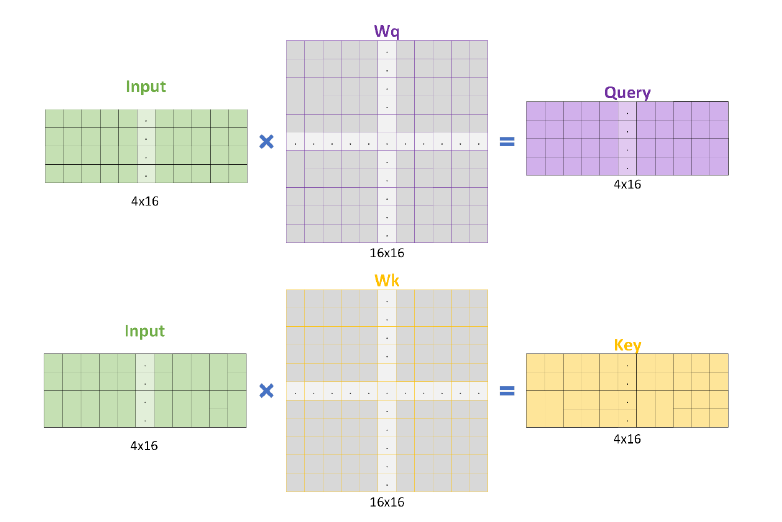
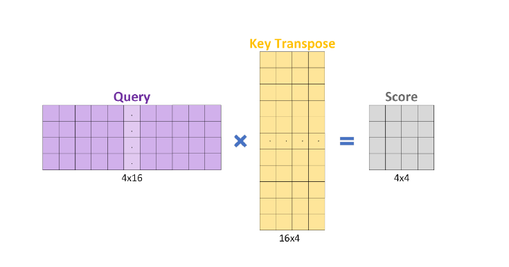

# Example: Why This Design Matters in Real SoCs
This document provides an intuitive, real-world explanation of why the **Scaled Dot-Product Attention Accelerator** is an important building block in modern SoCs.

## The Attention Problem
Imagine you’re reading a sentence:
> “The cat sat on the mat because it was tired.”

When the Transformer processes the word “it”, it must decide whether “it” refers to the **cat** or the **mat**. To do this, it calculates how strongly “it” relates to every other word. This process is known as the **attention mechanism**.

It builds three key matrices:
- **Q (Query):** Represents the current word (“it”)
- **K (Key):** Represents all other words
- **V (Value):** Contains the meaning of each word

  

<b>Figure 1 – Query and Key generation.</b>

Then it computes:
> **S = Q × Kᵀ** → attention scores  
> **Z = softmax(S) × V** → weighted output

  

<b>Figure 2 – Score matrix and final weighted output computation.</b>

## The Problem on CPUs and GPUs
For a sentence with 512 tokens:
- Q, K, V are 512×512 matrices  
- That’s over **134 million multiplications** just to find attention scores  
- And Transformers repeat this across **dozens of layers**
CPUs and GPUs can compute this but waste energy moving data between memory and compute units, which is fine for data centers, not for **real-time or on-device AI**.

## What the Hardware Accelerator Does Better
This design focuses **only on the math** - nothing else.   
It uses:
1. A **15-state FSM** to control every operation precisely  
2. **Local SRAMs** for Input, Weight, Result, and Scratchpad data  
3. A **Multiply-Accumulate unit** that runs continuously  
4. Optimized **transposed memory storage** for efficient access during `Z = S × V`

**Result Highlights:**  
- No wasted cycles  
- No cache misses  
- Lower energy per operation  
- Deterministic latency

## In a Real SoC
Inside a modern SoC (e.g., Qualcomm Snapdragon or Apple M-series):
- The **CPU** sends configuration data to the accelerator  
- The accelerator computes Q, K, V, S, and Z matrices autonomously  
- Results are written back to system memory or passed to the next AI pipeline stage  
- The **NPU or AI engine** repeats this across multiple attention heads and layers  
These computations are repeated across multiple tokens and heads, making efficiency critical in real-time inference..

This accelerator becomes a **key building block** for Transformer-based workloads:
- Speech recognition  
- On-device translation  
- Vision Transformers (object detection)  
- LLM inference acceleration  

---

## Summary
Transformers are massive relational calculators. This design implements a **small, specialized hardware calculator** that performs only the attention math precisely, efficiently, and at hardware speed.

Dedicated attention accelerators have become essential components of **modern AI SoCs**, enabling low-power and high-performance inference for edge and embedded applications.

---
**Author:** Vishnuvardhan Chilukoti  
**Course:** ECE 564 – ASIC & FPGA Design Using Verilog, North Carolina State University  
**Contact:** [vchiluk3@gmail.com](mailto:vchiluk3@gmail.com)